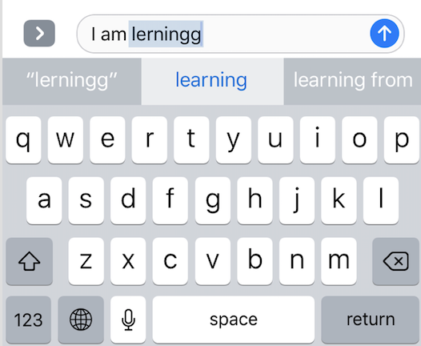

# Using NLP to build auto correction words engine

 Figure 1 

Data source :
- Text based on https://norvig.com/big.txt
- https://norvig.com/spell-correct.html as reference for this project

The goal of this spell check model is to compute the following probability: $$P(c|w) = \frac{P(w|c)\times P(c)}{P(w)}$$ (known as Bayes rule)